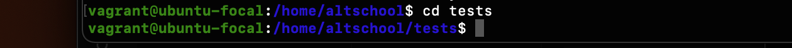
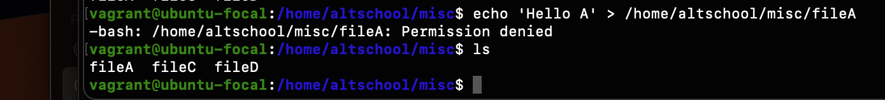
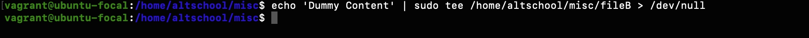
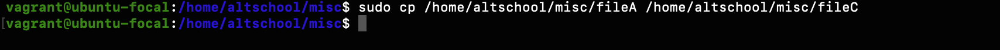
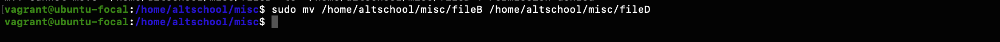
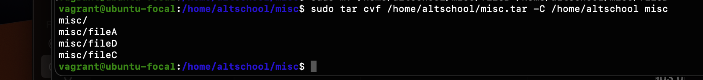
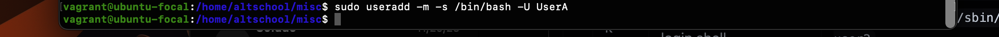

Your login name: altschool i.e., home directory /home/altschool. The home directory contains the following sub-directories: code, tests, personal, misc Unless otherwise specified, you are running commands from the home directory.

| Task | Task Description                                                                                  | Solution                                                                | Image                                              |
| ---- | ------------------------------------------------------------------------------------------------- | ----------------------------------------------------------------------- | -------------------------------------------------- |
| a    | Change to the tests directory using absolute pathname                                             | cd /home/altschool/tests                                                |  |
| b    | Change to the tests directory from your home directory using relative pathname                    | cd ./test                                                               |  |
| c    | Use echo command to create a file named fileA with text content ‘Hello A’ in the misc directory | **echo 'Hello A' > /home/altschool/misc/fileA**                   |  |
| d    | Create an empty file named fileB and populate it with dummy contents                              | echo 'Dummy Content' sudo tee /home/altschool/misc/fileB> /dev/null     |  |
| e    | Copy contents of fileA into fileC                                                                 | sudo cp /home/altschool/misc/fileA /home/altschool/misc/fileC           |  |
| F    | Move contents of fileB into fileD                                                                 | **sudo mv /home/altschool/misc/fileB /home/altschool/misc/fileD** |  |
| G    | Create a tar archive called misc.tar for the contents of misc directory                           | sudo tar cvf /home/altschool/misc.tar -C /home/altschool misc           |  |
| H    | Compress the tar archive to create a misc.tar.gz file                                             | sudo gzip /home/altschool/misc.tar                                      |  |
| I    | Create a user and force the user to change his/her password upon login                            | Lock a users password                                                   |  |
| J    | Lock a users password                                                                             | **sudo passwd -l UserA**                                          |  |
| K    | Create a user with no login shell                                                                 | **sudo useradd -M -s /usr/sbin/nologin UserA**                    |  |

| L | Disable password based authentication for ssh | sudo nano /etc/ssh/sshd_config |  |
| - | --------------------------------------------- | ------------------------------ | ------------------------------------------------------------------------------------------------------------------------------------- |
| M | Disable root login for ssh                    | sudo nano /etc/ssh/sshd_config |  |
